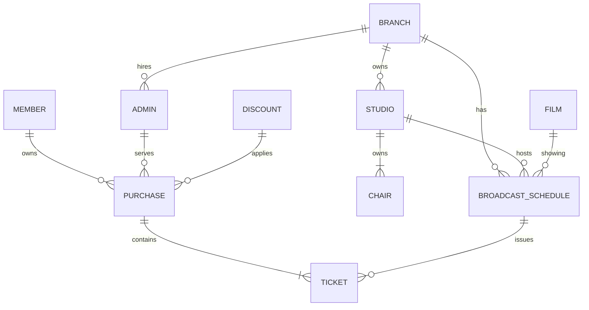
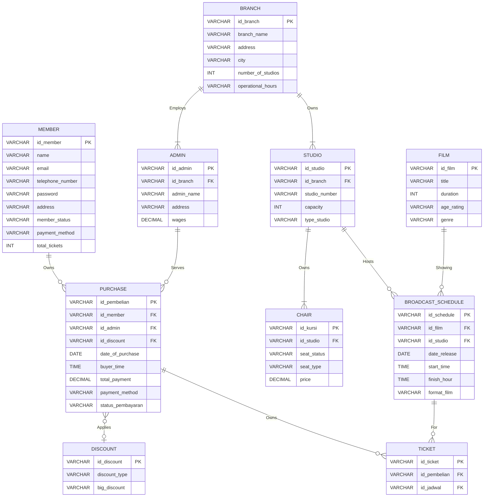

# 🎬 VVI Cinema System - Conceptual & Logical Database Modeling

> **Database Modeling Course Final Project**  
> **Institution:** Telkom University (Faculty of Informatics)  
> **Class:** IF-05-02 | **Group 4**

---

## 👥 Group Members

| Name | Student ID (NIM) |
| :--- | :--- |
| **Stefani Amelia Deviera** | `108072530009` |
| **Eugenia Kinanti Sandang Pato'** | `108072500057` |
| **Dinda Rizki Anindita** | `108072500005` |
| **Agni Nurmala Setyawati** | `108072500146` |

---

## 📌 Executive Summary

VVI Cinema is a major cinema network located in Bandung that requires a database system to streamline online and counter ticket bookings, handle payments, and record daily transactions. 

This project covers:
1. **Conceptual Modeling:** Defining core entities, attributes, and business constraints.
2. **Entity-Relationship Diagram (ERD):** Mapping cardinality and optionality across the system.
3. **Logical Modeling:** Translating ERDs into a relational schema complete with Primary and Foreign Keys.

---

### Business Rules Details
1. System Users: There are two types of users in this application, namely admin and member. Admin is an employee who is responsible for managing transactions, film schedules, and customer service. Members can purchase tickets online or offline, while non-members can only purchase tickets offline at the cinema ticket counter.
2. Account Management: Each member has an account with information such as name, email, phone number, and password. Admin data includes address, salary, and branch data.
3. Purchase Term and Discounts: Member may purchase one or more tickets. DIscounts may be awarded based on specific events, membership status, or payment methods.
4. Transaction and Payment Mechanism: Each purchase is recorded with the purchase number, purchase date, purchase time, discount, total payment, payment method, status (Unpaid/Paid/Cancelled). For non-member customers, purchases can only be made offline at the counter and customer data will not be saved, but non-member purchase transactions will be represented by the data of the admin who handles the transaction.
5. Ticket Details and Purchaser Validation: This page displays detailed information about the ticket purchased. Ticket contain information such as the ticket number, purchaser details (if the purchaser is a member). Otherwise, the purchaser details are left blank if the purchase is made by a non-member, the schedule, studio details and seat number, the film being shown, and the ticket price.
6. FIlm Management and Scheduling: Films have details such as title, duration, genre, age rating, and showtime. Each showtime is only valid for one film from one studio at a certain time. Each film can be grouped into several genres. The showtime consists of film data, studio data, cinmea branch data, showtime, start time, end time, film format(2D/3D/IMAX/4DX).
7. Branch and Studio Facilities: Each branch has information on the branch name, address, city, number of studios, and operating hours. Each studio has a studio number, capacity, and studio type (2D, 3D, IMAX, VIP, etc.).
8. Seat Management: Each seat in the studio has a seat number, seat type (Regular/VIP/Sofa/Recliner), and status (available/reserved/damaged). Each seat can only be reserved by one ticket at a specific showtime and cannot be used by more than one buyer at the same time.

---

## Conceptual Modelling
### 1. Entities and Attributes

| No. | Entity Name | Entity Type | Description |
| :---: | :---: | :---: | :---: |
| **1.** | **Member** | Strong Entity | **Customers are parties who make purchases of goods or services offered by a company.**  Customers can be individuals or companies/organizations. |
| **2.** | **Admin** | Strong Entity | Cinema employees or staff whose job is to manage transaction data, film schedules, studio operations, and serve ticket purchases at the physical counter. |
| **3.** | **Branch** | Strong Entity | The physical location or place of a VVI cinema that operates in a particular city and has facilities such as several studios and administrative staff. |
| **4.** | **Purchase** | Strong Entity | A valid transaction record or payment receipt for the purchase of one or more tickets by a customer (member or non-member). |
| **5.** | **Studio** | Strong Entity | A film screening room located within a cinema branch, which has a certain capacity and a certain type of media projection technology. |
| **6.** | **Chair** | Strong Entity | Represents a physical seating asset, where each seat has its own unique Seat ID within the system (independent of the studio number for its primary identification), and is related to the Studio entity. |
| **7.** | **Film** | Strong Entity | Audio-visual works of art (wide screen) registered in the system for screening in cinemas, complete with information on duration, age rating, and genre. |
| **8.** | **Broadcast Schedule** | Strong Entity | A specific screening session of a film at a specific studio and branch on a specified date and time. |
| **9.** | **Tickets** | Strong Entity | Proof of physical or electronic transactions that have their own unique code (such as Ticket ID or Serial Number), which gives viewers access rights to watch films at certain showtimes and seat numbers. |
| **10.** | **Discount** | Strong Entitiy | Active discount or promo programs that can be applied to purchase transactions based on criteria or conditions certain. |

Table 1 List of Entities

## 🏛 Entity & Attribute Definitions

### 👤 User & Administrative Entities

#### 1. `Member` *(Strong Entity)*
Registered cinema customers who can book tickets online or offline.

| Attribute Name | Type | Description | Example |
| :--- | :--- | :--- | :--- |
| `id_member` **(PK)** | Primary Key | Unique identification code for each member | `MBR001` |
| `name` | Simple | Full name of registered member | `Aisha Putri` |
| `email` | Simple | Active email address used for login | `lalilu123@gmail.com` |
| `telephone_number` | Simple | Member contact phone number | `08123456789` |
| `password` | Simple | Secret application password | `R4ra07` |
| `address` | Composite | Residential address details | `Jl. Merdeka No. 10` |
| `member_status` | Simple | Membership level tier | `Gold` |
| `payment_method` | Simple | Preferred/frequently used payment option | `QRIS` |
| `total_tickets` | Derived | Accumulated counter of all tickets ever purchased | `5` |

---

#### 2. `Admin` *(Strong Entity)*
Cinema employees who manage schedules, transaction records, and counter sales.

| Attribute Name | Type | Description | Example |
| :--- | :--- | :--- | :--- |
| `id_admin` **(PK)** | Primary Key | Special identification code for each staff member | `ADM001` |
| `id_branch` **(FK)** | Foreign Key | Reference code for the branch where admin is assigned | `CBG01` |
| `admin_name` | Simple | Full name of duty admin | `Eugenia Alin` |
| `address` | Simple | Staff home address | `Jl. Buah Batu No. 10` |
| `wages` | Simple | Monthly employee salary amount | `5000000` |

---

### 🏢 Physical & Operational Entities

#### 3. `Branch` *(Strong Entity)*
Physical cinema building location operating within a city.

| Attribute Name | Type | Description | Example |
| :--- | :--- | :--- | :--- |
| `id_branch` **(PK)** | Primary Key | Unique code for each cinema branch | `CBG01` |
| `branch_name` | Simple | Name of the cinema branch | `XXI Tunjungan` |
| `address` | Composite | Street address of branch | `Jl. Basuki Rahmat No. 8` |
| `city` | Simple | City location | `Surabaya` |
| `number_of_studios` | Derived | Total studios operating in branch | `5` |
| `operational_hours` | Simple | Opening and closing hours | `10:00 - 22:00` |

---

#### 4. `Studio` *(Strong Entity)*
Individual screening hall within a cinema branch.

| Attribute Name | Type | Description | Example |
| :--- | :--- | :--- | :--- |
| `id_studio` **(PK)** | Primary Key | Unique code for each studio hall | `STD01` |
| `id_branch` **(FK)** | Foreign Key | Associated cinema branch code | `CB001` |
| `studio_number` | Simple | Studio room identifier | `Studio 1` |
| `capacity` | Derived | Maximum guest capacity | `150` |
| `type_studio` | Simple | Media projection type (e.g., 2D, 3D, IMAX) | `IMAX` |

---

#### 5. `Chair` *(Strong Entity)*
Physical seating asset within a specific studio.

| Attribute Name | Type | Description | Example |
| :--- | :--- | :--- | :--- |
| `id_kursi` **(PK)** | Primary Key | Unique code for each seat | `KRS01` |
| `id_studio` **(FK)** | Foreign Key | Studio where seat is located | `ST001` |
| `seat_status` | Simple | Availability condition (`Available`/`Reserved`/`Damaged`) | `Available` |
| `seat_type` | Simple | Seating tier (`Reg`/`VIP`/`Sofa`/`Recliner`) | `VIP` |
| `price` | Simple | Base seat price based on tier | `50000` |

---

### 🎥 Media & Scheduling Entities

#### 6. `Film` *(Strong Entity)*
Movie registered in system for screening sessions.

| Attribute Name | Type | Description | Example |
| :--- | :--- | :--- | :--- |
| `id_film` **(PK)** | Primary Key | Unique identification code for each movie | `FLM-001` |
| `title` | Simple | Title of the film | `Aran` |
| `duration` | Simple | Length of movie in minutes | `181` |
| `age_rating` | Simple | Content rating restriction | `13+` |
| `genre` | Simple | Genre classification | `Comedy, Horror` |

---

#### 7. `Broadcast_Schedule` *(Strong Entity)*
Specific screening session for a film in a studio.

| Attribute Name | Type | Description | Example |
| :--- | :--- | :--- | :--- |
| `id_schedule` **(PK)** | Primary Key | Unique screening session code | `JDW001` |
| `id_film` **(FK)** | Foreign Key | Movie identifier scheduled | `FLM05` |
| `id_studio` **(FK)** | Foreign Key | Studio room identifier assigned | `STD02` |
| `date_release` | Simple | Date of screening | `2026-04-02` |
| `start_time` | Simple | Session starting time | `19:00` |
| `finish_hour` | Simple | Estimated conclusion time | `21:00` |
| `format_film` | Simple | Format technology (e.g., 2D, IMAX, 4DX) | `IMAX` |

---

### 💳 Transaction & Ticket Entities

#### 8. `Purchase` *(Strong Entity)*
Transaction receipt/order for one or more tickets.

| Attribute Name | Type | Description | Example |
| :--- | :--- | :--- | :--- |
| `id_pembelian` **(PK)**| Primary Key | Unique transaction invoice marker | `TR-20260329-001` |
| `id_member` **(FK)** | Foreign Key *(Nullable)* | Member ID (Blank for non-member purchases) | `MBR001` |
| `id_admin` **(FK)** | Foreign Key *(Nullable)* | Serving cashier admin ID | `ADM001` |
| `id_discount` **(FK)** | Foreign Key *(Nullable)* | Discount program applied | `DSK01` |
| `date_of_purchase` | Simple | Date transaction occurred | `2026-03-29` |
| `buyer_time` | Simple | Time transaction completed | `09:00` |
| `total_payment` | Derived | Final calculated payment amount | `45000` |
| `payment_method` | Simple | Payment channel used | `Debit` |
| `status_pembayaran`| Simple | Status (`Paid Off`/`Unpaid`/`Cancelled`) | `Paid Off` |

---

#### 9. `Discount` *(Strong Entity)*
Promo and event discount rules.

| Attribute Name | Type | Description | Example |
| :--- | :--- | :--- | :--- |
| `id_discount` **(PK)** | Primary Key | Unique discount program ID | `DSK01` |
| `discount_type` | Simple | Type/category of discount promo | `PMB001` |
| `big_discount` | Simple | Value/percentage rate | `15%` |

---

#### 10. `Ticket` *(Strong Entity)*
Physical or digital pass granting access to a showtime and seat.

| Attribute Name | Type | Description | Example |
| :--- | :--- | :--- | :--- |
| `id_ticket` **(PK)** | Primary Key | Unique ticket serial code | `TKT-VVI-001` |
| `id_pembelian` **(FK)**| Foreign Key | Reference purchase invoice | `TR-20260329-001` |
| `id_jadwal` **(FK)** | Foreign Key | Reference screening schedule | `JDW001` |

---

## 🔄 Relationship Rules & Cardinalities

| No | Entity #1 | Relation Name | Entity #2 | Cardinality & Constraints |
| :---: | :--- | :---: | :--- | :--- |
| **1** | Member | Own | Purchase | One-to-Many *(Optional - Mandatory)* |
| **2** | Admin | Serve | Purchase | One-to-Many *(Optional - Mandatory)* |
| **3** | Admin | Hiring / Employed | Branch | Many-to-One *(Mandatory - Optional)* |
| **4** | Purchase | Apply | Discount | Zero-to-One / Many-to-One *(Optional)* |
| **5** | Branch | Own | Studio | One-to-Many *(Optional - Mandatory)* |
| **6** | Branch | Has | Broadcast Schedule | One-to-Many *(Optional - Mandatory)* |
| **7** | Studio | Own | Chair | One-to-Many *(Mandatory - Mandatory)* |
| **8** | Studio | Do / Host | Broadcast Schedule | One-to-Many *(Optional - Mandatory)* |
| **9** | Film | Showing | Broadcast Schedule | One-to-Many *(Optional - Mandatory)* |
| **10** | Broadcast Schedule | For | Ticket | One-to-Many *(Optional - Mandatory)* |
| **11** | Purchase | Serve / Own | Ticket | One-to-Many *(Optional - Mandatory)* |

---

## 📐 Entity Relationship Diagram (ERD)

### Database Schema & Relationship Diagram

